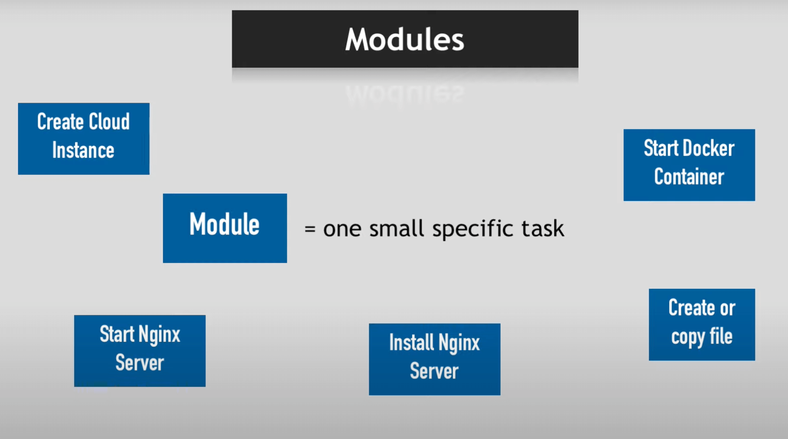
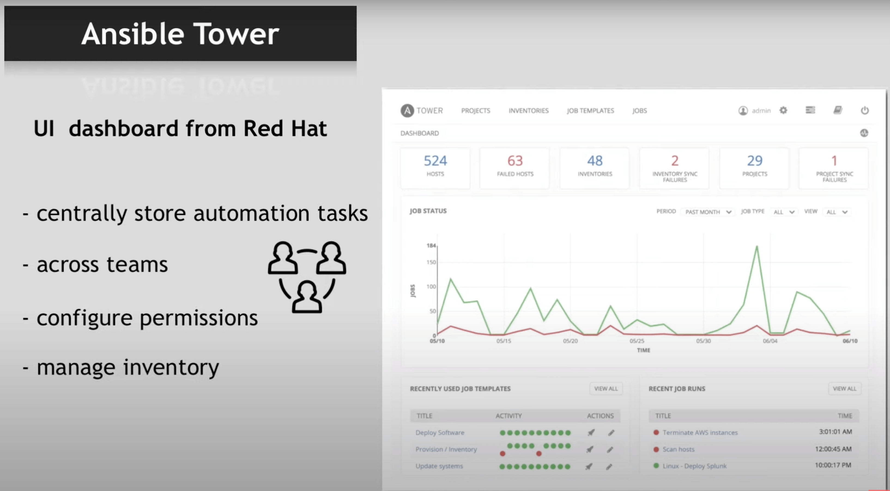

# About Ansible 🤖

!!!info
		Tool to automate IT tasks

### Why use Ansible?

For example you have 10 servers and want to deploy a new version of an app on it, or update Docker on them. So you have to ssh to those servers and do it by yourself and it’s time consuming.

1. Execute tasks from your own machine
2. _Configurations_ | _Installation_ | _Deployment_ step in a single `YAML` file
3. Re-use same file for different environments
4. More reliable & less likely for errors

!!!info
		**Ansible** supports all infrastructure and it is **agentless.**

[](https://www.youtube.com/watch?v=1id6ERvfozo)

## Ansible Playbooks

```yaml
tasks:
	- name: a task in postgres  # Description of task
		postgresql_table:         # Module name
			table: foo              # Arguments
			rename: bar             # Arguments

	- name: change owner # Description of task
		postgresql_table:  # Module name
			name: foo        # Arguments
			owner: newuser   # Arguments
```

### Execute multiple modules in a sequence

```yaml
tasks:
	- name: create dir for nginx
		file:
			path: /path/to/nginx
			state: directory

	- name: install latest nginx
		yum:
			name: nginx
			state: latest

	- name: start nginx
		service:
			name: nginx
			state: started
```

### Where to execute tasks and who execute them?

```yaml
- hosts: databases
	remote_user: root
	vars:
		tablename: foo
		tableowner: newuser

	tasks:
		- name: rename table from {{ tablename }} to bar
			postgresql_table:
				table: {{ tablename }}
				rename: bar

		- name: change owner
			postgresql_table:
				name: {{ tablename }}
				owner: {{ tableowner }}
```

!!!warning
		This file 👆 is called a `play` and you can have multiple **plays** in a single _YAML_ file. That file called a `Playbook` and with name tag you can name **plays.**

### Where are hosts value come from?

!!!success
		Ansible **Inventory** List

Inventory means all the machines involved in task executions

**Hosts file 👇**

```
130.24.1.100

[databases]
130.24.2.23
130.24.2.24

[webservers]
api1.servers.com
api2.servers.com
```

## [Ansible Tower](https://docs.ansible.com/ansible/2.5/reference_appendices/tower.html)



course on [youtube](https://www.youtube.com/watch?v=1id6ERvfozo).
