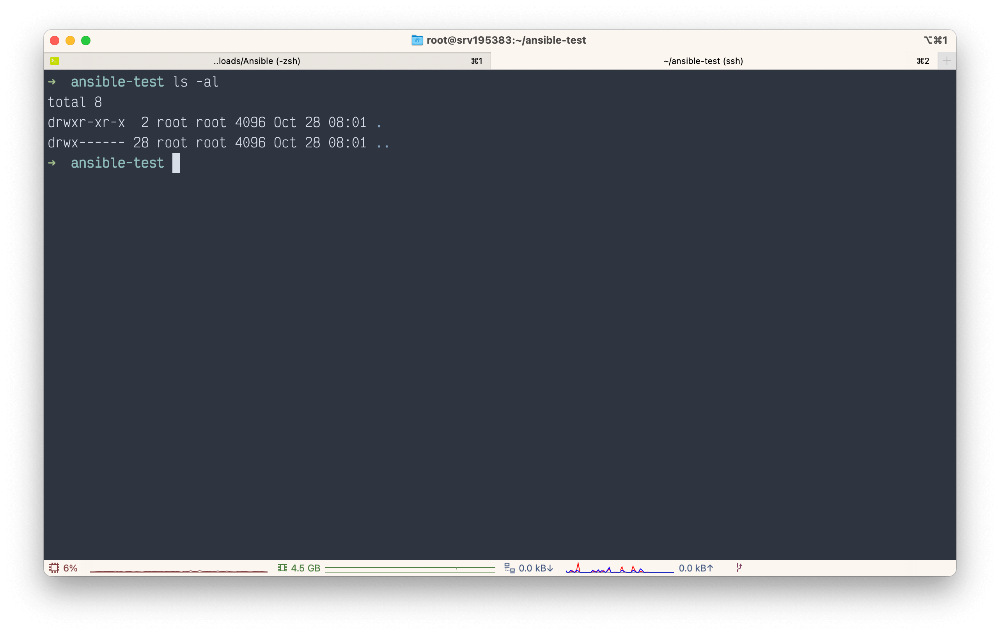
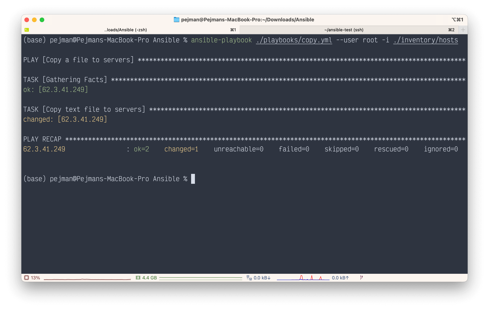
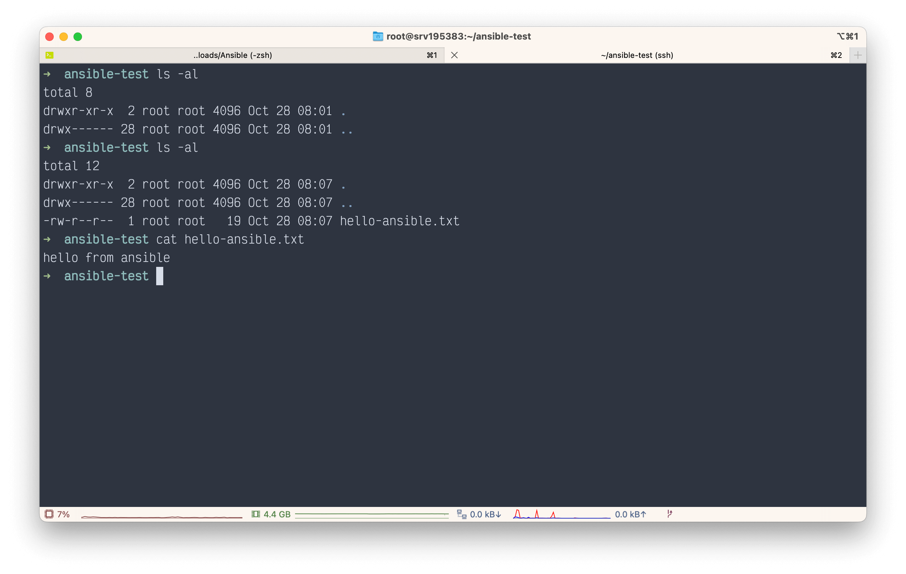

# Ansible in Action

## Installation

!!!note 
    There is no need to install ansible on servers, only on your **local machine**

- Linux

```bash
$ sudo apt install ansible
```

- MacOS

```bash
% brew install ansible
```

- Check ansible

<div class="termy">

```console
ansible --version

// Output
ansible [core 2.13.5]
  config file = None
  configured module search path = ['/Users/pejman/.ansible/plugins/modules', '/usr/share/ansible/plugins/modules']
  ansible python module location = /opt/homebrew/Cellar/ansible/6.5.0/libexec/lib/python3.10/site-packages/ansible
  ansible collection location = /Users/pejman/.ansible/collections:/usr/share/ansible/collections
  executable location = /opt/homebrew/bin/ansible
  python version = 3.10.8 (main, Oct 13 2022, 09:48:40) [Clang 14.0.0 (clang-1400.0.29.102)]
  jinja version = 3.1.2
  libyaml = True
```
</div>

---

## Check ansible

Create a folder called `inventory` and in that create a new file called `hosts` and group server IP and dns address in it.

[hosts](https://github.com/pejmanS21/Ansible-Tutorial/blob/main/resources/inventory/hosts):

``` title="inventory/hosts"
[servers]
123.4.56.7
api1.test.com
...
```

!!!info
    **_You can Specify that each server uses specific `ssh-key`_** 👇


```title="inventory/hosts"
[servers]
123.4.56.7
api1.test.com

[servers:vars]
ansible_ssh_private_key_file=~/.ssh/id_ed25519
ansible_user=root
...
```

!!!warning
    **_ansible can't pass sshHostKeyChecking by default `([yes/no/fingerprint])`. Although there is a way to ignore it via `~/.ansible.cfg` filr but it's NOT recommended for long-live servers!_**

after that excute following command:

```bash
ansible -i ./inventory/hosts servers -m ping --user root
```

??? tip
    Use `--ask-pass` if needed!

	```bash
	ansible -i ./inventory/hosts servers -m ping --user root --ask-pass
	```

<div class="termy">

```console
$ ansible -i ./inventory/hosts servers -m ping --user root

// Output:

123.4.56.7 | SUCCESS => {
    "ansible_facts": {
        "discovered_interpreter_python": "/usr/bin/python3"
    },
    "changed": false,
    "ping": "pong"
}
```

</div>

this means ansible can connect to servers and you are good to go.

---

## [Collections](https://docs.ansible.com/ansible/latest/collections/index.html)

List of modules and plugins that can be executed by ansible, whether built-in or installable via `ansible-galaxy`.<br>

!!!info
    [ansible-galaxy](https://galaxy.ansible.com) is hub to upload & download ansible collections


=== "`ansible-galaxy` Command"
    ```bash
    ansible-galaxy collection list
    ```

=== "Collection List" 
    ```
    # /opt/homebrew/Cellar/ansible/6.5.0/libexec/lib/python3.10/site-packages/ansible_collections
    Collection                    Version
    ----------------------------- -------
    amazon.aws                    3.5.0
    ansible.netcommon             3.1.3
    ansible.posix                 1.4.0
    ansible.utils                 2.6.1
    ansible.windows               1.11.1
    arista.eos                    5.0.1
    awx.awx                       21.7.0
    azure.azcollection            1.13.0
    check_point.mgmt              2.3.0
    chocolatey.chocolatey         1.3.1
    cisco.aci                     2.2.0
    cisco.asa                     3.1.0
    cisco.dnac                    6.6.0
    cisco.intersight              1.0.19
    cisco.ios                     3.3.2
    cisco.iosxr                   3.3.1
    cisco.ise                     2.5.5
    cisco.meraki                  2.11.0
    cisco.mso                     2.0.0
    cisco.nso                     1.0.3
    cisco.nxos                    3.2.0
    cisco.ucs                     1.8.0
    cloud.common                  2.1.2
    cloudscale_ch.cloud           2.2.2
    community.aws                 3.6.0
    community.azure               1.1.0
    community.ciscosmb            1.0.5
    community.crypto              2.7.0
    community.digitalocean        1.22.0
    community.dns                 2.3.3
    community.docker              2.7.1
    community.fortios             1.0.0
    community.general             5.7.0
    community.google              1.0.0
    community.grafana             1.5.3
    community.hashi_vault         3.3.1
    community.hrobot              1.5.2
    community.libvirt             1.2.0
    community.mongodb             1.4.2
    community.mysql               3.5.1
    community.network             4.0.1
    community.okd                 2.2.0
    community.postgresql          2.2.0
    community.proxysql            1.4.0
    community.rabbitmq            1.2.2
    community.routeros            2.3.0
    community.sap                 1.0.0
    community.sap_libs            1.3.0
    community.skydive             1.0.0
    community.sops                1.4.1
    community.vmware              2.10.0
    community.windows             1.11.0
    community.zabbix              1.8.0
    containers.podman             1.9.4
    cyberark.conjur               1.2.0
    cyberark.pas                  1.0.14
    dellemc.enterprise_sonic      1.1.2
    dellemc.openmanage            5.5.0
    dellemc.os10                  1.1.1
    dellemc.os6                   1.0.7
    dellemc.os9                   1.0.4
    f5networks.f5_modules         1.20.0
    fortinet.fortimanager         2.1.5
    fortinet.fortios              2.1.7
    frr.frr                       2.0.0
    gluster.gluster               1.0.2
    google.cloud                  1.0.2
    hetzner.hcloud                1.8.2
    hpe.nimble                    1.1.4
    ibm.qradar                    2.1.0
    ibm.spectrum_virtualize       1.10.0
    infinidat.infinibox           1.3.3
    infoblox.nios_modules         1.4.0
    inspur.ispim                  1.1.0
    inspur.sm                     2.2.0
    junipernetworks.junos         3.1.0
    kubernetes.core               2.3.2
    mellanox.onyx                 1.0.0
    netapp.aws                    21.7.0
    netapp.azure                  21.10.0
    netapp.cloudmanager           21.20.1
    netapp.elementsw              21.7.0
    netapp.ontap                  21.24.1
    netapp.storagegrid            21.11.1
    netapp.um_info                21.8.0
    netapp_eseries.santricity     1.3.1
    netbox.netbox                 3.8.0
    ngine_io.cloudstack           2.2.4
    ngine_io.exoscale             1.0.0
    ngine_io.vultr                1.1.2
    openstack.cloud               1.10.0
    openvswitch.openvswitch       2.1.0
    ovirt.ovirt                   2.2.3
    purestorage.flasharray        1.14.0
    purestorage.flashblade        1.10.0
    purestorage.fusion            1.1.1
    sensu.sensu_go                1.13.1
    servicenow.servicenow         1.0.6
    splunk.es                     2.1.0
    t_systems_mms.icinga_director 1.31.0
    theforeman.foreman            3.7.0
    vmware.vmware_rest            2.2.0
    vultr.cloud                   1.1.0
    vyos.vyos                     3.0.1
    wti.remote                    1.0.4
    ```

## playbooks

for example we want to `apt update` and install `oh-my-zsh` on our servers via ansible. we need to use **playbooks** in order to do that.

To execute a playbook use following command:

<div class="termy">

```console
$ ansible-playbook ./playbooks/apt.yml --user root -i ./inventory/hosts

// Output

PLAY [servers] **************************************************

TASK [Gathering Facts] ********************************************************
ok: [123.4.56.7]

TASK [apt] ********************************************************************
changed: [123.4.56.7]

PLAY RECAP **********************************************************
123.4.56.7                : ok=2    changed=1    unreachable=0    failed=0    skipped=0    rescued=0    ignored=0
```
</div>

---

!!! tip "Multiple tasks in a Playbook"
	If you want to run multiple tasks in a playbook concurrently, use async with poll set to 0. When you set `poll: 0`, Ansible starts the task and immediately moves on to the next task without waiting for a result. Each async task runs until it either completes, fails or times out (runs longer than its async value). The playbook run ends without checking back on async tasks. Check [npm-install.yml](https://github.com/pejmanS21/Ansible-Tutorial/blob/main/resources/playbooks/npm-install.yml) in playbooks.


### Use `shell` command in **ansible** playbook

```yaml title="playbooks/shell.yml"
---
- name: Example SHELL Command
  hosts: servers
  tasks:
    - name: Check a specific docker container and Print it
      shell: docker ps | grep "<container_name>"
      register: container_status # Save results of shell command in "container_status" variable
    - debug: msg={{container_status.stdout_lines}}
```

<div class="termy">

```console
$ ansible-playbook ./playbooks/shell.yml --user root -i ./inventory/hosts

// Output

ok: [123.4.56.7] => {
    "msg": [
        "49b69674c9e2   portainer/portainer-ce:latest                 \"/portainer\"             7 days ago     Up 7 days    8000/tcp, 9443/tcp, 0.0.0.0:9000->9000/tcp, :::9000->9000/tcp                                                                               portainer"
    ]
}
```

</div>

---

## Variables

In the `YAML` file, variables are declared with curly braces `{{ }}`, but there are some points that we should consider:

1. If curly braces come right after `:` **YAML** consider them as **YAML** dictionary so we have to define it like `"{{variable}}"`

```yaml
---
src: "{{file-location}}"
```

2. If curly braces don't come right after `:` , you can define it just with curly braces

```yaml
---
src: /path/to/file-{{version}}.tar
```

### Define variables

1. Hard coded in playbook:

```yaml
---
vars:
  - dest: /root/path/to/remote
```

2. In Command line:

```bash
$ ansible-playbook -i inventory/hosts playbooks/create-user.yml --extra-vars "username=pejman user_group=admin"
```

3. In [variable file](https://github.com/pejmanS21/Ansible-Tutorial/blob/main/resources/vars/project-vars.yaml) (format: `YAML`):

```yaml
---
- name: Create User in SERVER
  hosts: servers
  vars_files:
    - "../vars/project-vars.yaml"
  vars:
    user_comment: this_{{username}}
  tasks: ...
```

4. Prompt variables in `Terminal`:

```yaml
- name: Prompt variables in terminal
  hosts: servers
  vars_prompt:
    - name: prompted_variable
      prompt: Enter variables
      ...
```

```
Enter variables: 🔐

PLAY [Prompt variables in terminal] *********

TASK [Gathering Facts] *********
...
```

---

## Ansible Configurations

Create an [`ansible.cfg`](https://github.com/pejmanS21/Ansible-Tutorial/blob/main/resources/ansible.cfg) file to set some settings like path to inventory files, check hosts, etc. So you don't have to write them in command line **every time**

## Ansible with Docker

- [ansible Docker Login Module](https://docs.ansible.com/ansible/latest/collections/community/docker/docker_login_module.html)
- [ansible Docker Image Module](https://docs.ansible.com/ansible/latest/collections/community/docker/docker_image_module.html)
- [ansible Docker Compose Module](https://docs.ansible.com/ansible/latest/collections/community/docker/docker_compose_module.html)

Check these files to get familiar with ansible-docker integrations<br>

1. [Installation](https://github.com/pejmanS21/Ansible-Tutorial/blob/main/resources/playbooks/docker-installation.yml)
2. [Pull & Run docker service](https://github.com/pejmanS21/Ansible-Tutorial/blob/main/resources/playbooks/docker-collections.yml)

<br>

---

## Example






